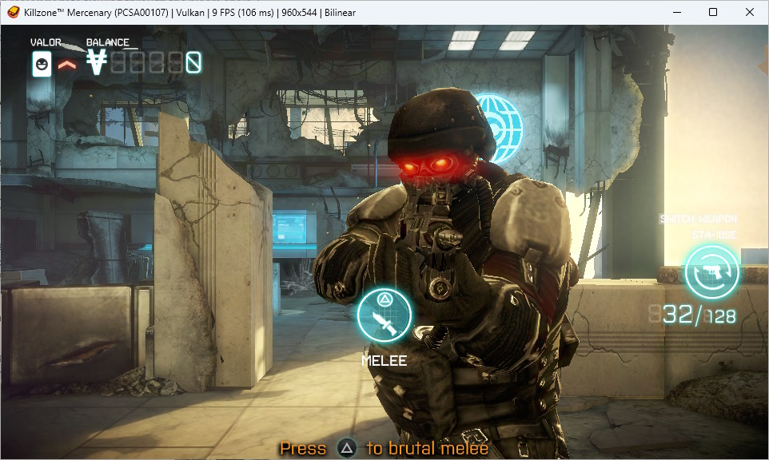
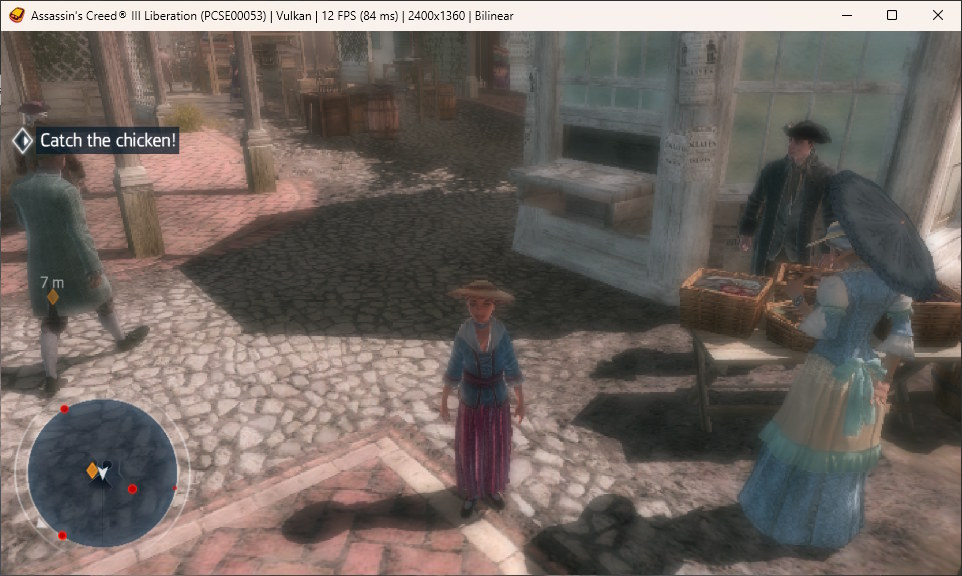
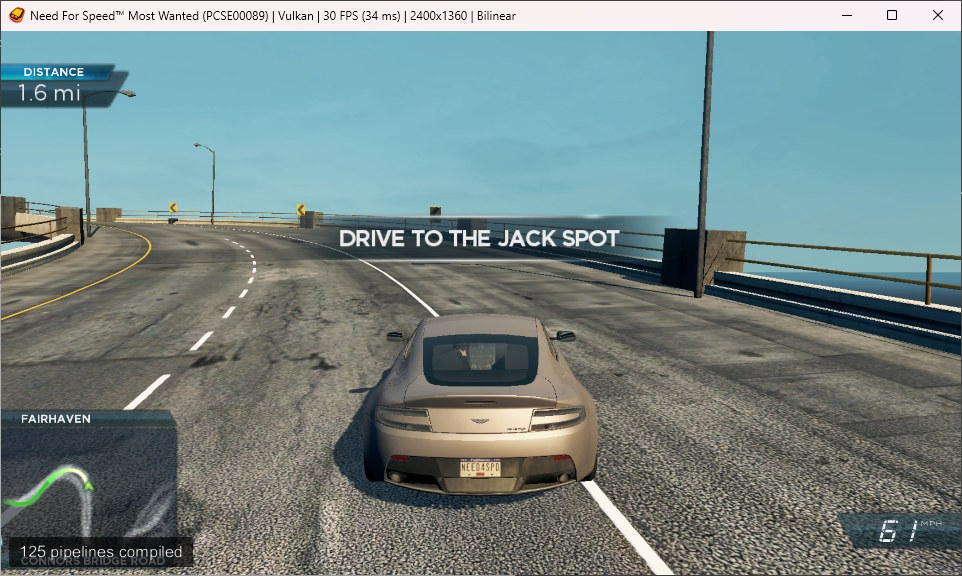
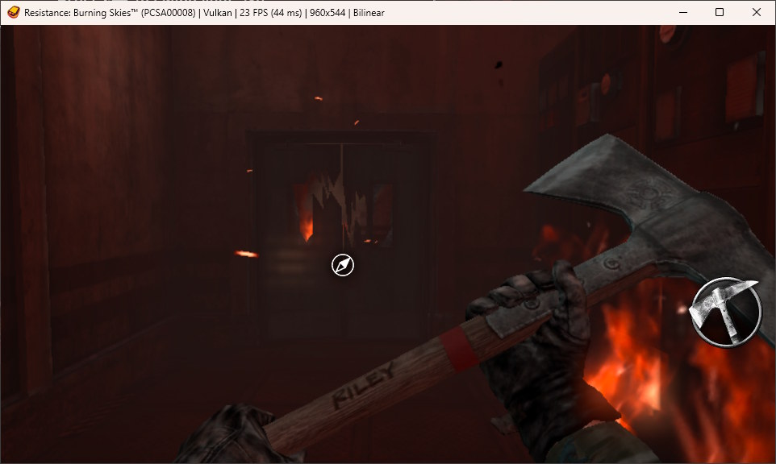
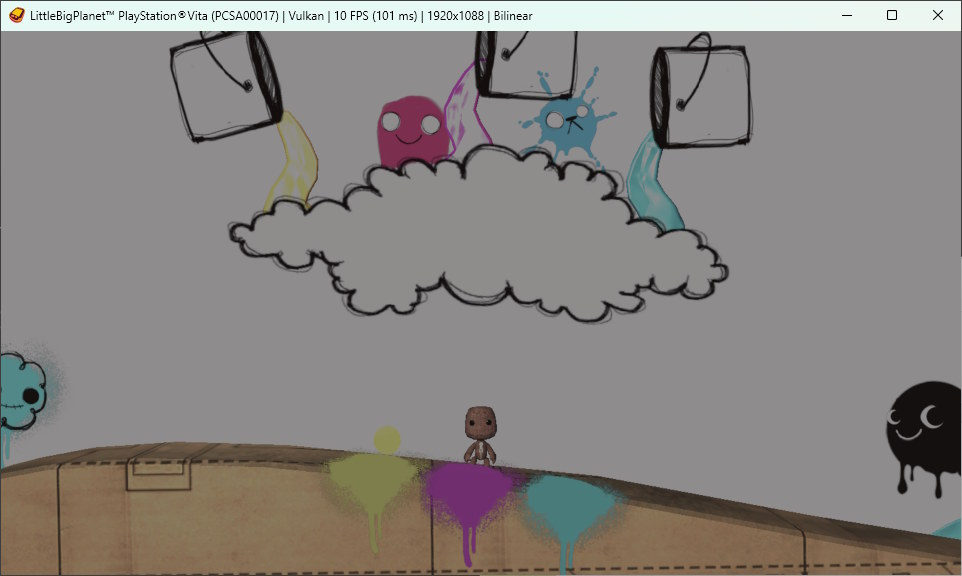
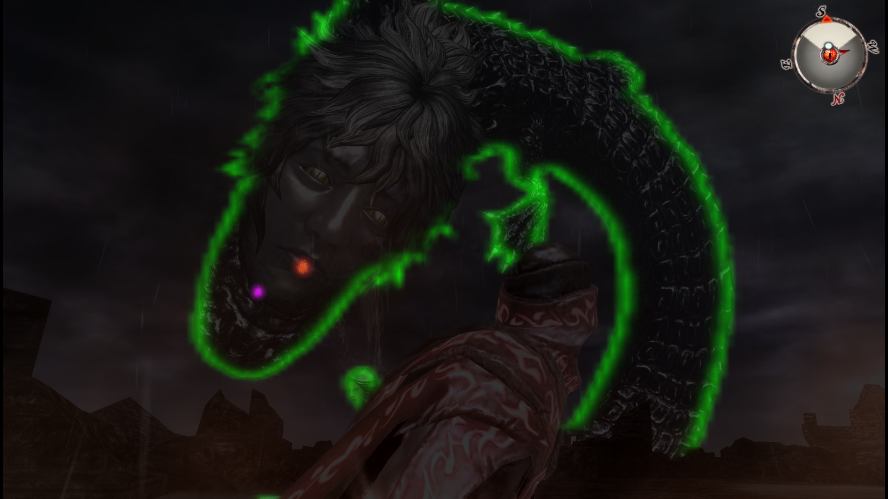
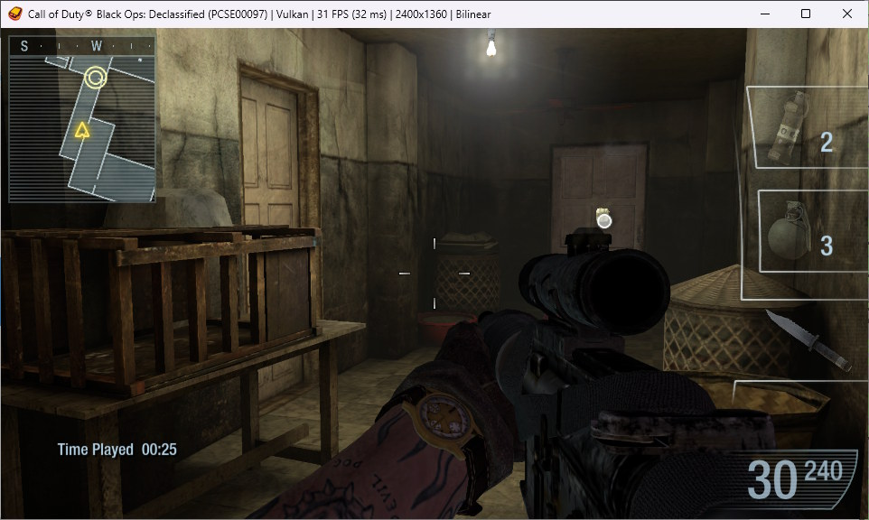
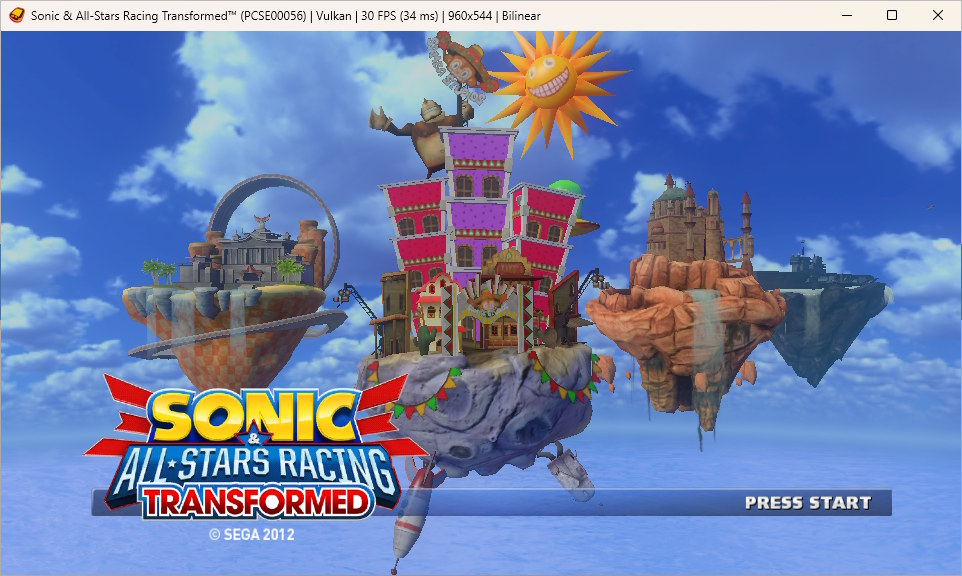
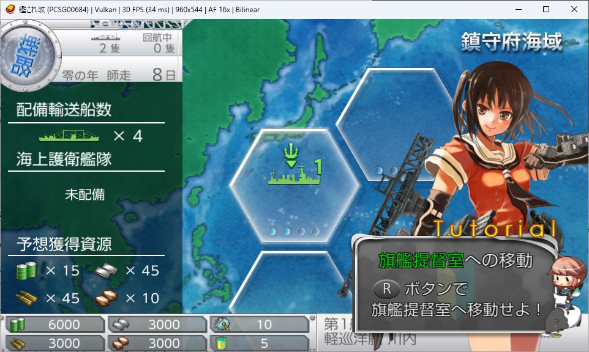
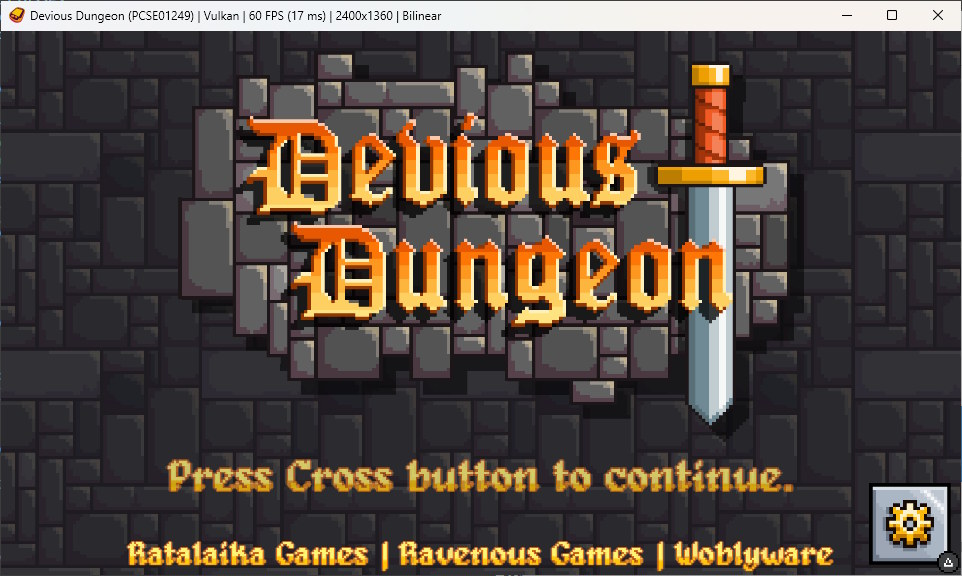

# Vita3K+ Screenshots

Games running in Vita3K+, showing the compatibility and rendering fixes in this fork.
Every one of these was either broken, glitched or wouldn't boot at all before.

|                                   **Killzone Mercenary**                                    |                            **Assassin's Creed III: Liberation**                             |
| :-----------------------------------------------------------------------------------------: | :-----------------------------------------------------------------------------------------: |
|  Textures, bloom, lighting, shadows and smoke all fixed |  Mask updates fixed, plus roof shadows at higher resolutions |

|                              **Need for Speed: Most Wanted**                               |                                **Resistance: Burning Skies**                                |
| :-----------------------------------------------------------------------------------------: | :-----------------------------------------------------------------------------------------: |
|  Floating badges and headlights through the road fixed |  Correct colours from F16 render targets, no more freezing |

|                                     **LittleBigPlanet**                                     |                                   **Soul Sacrifice Delta**                                  |
| :-----------------------------------------------------------------------------------------: | :-----------------------------------------------------------------------------------------: |
|  Missing backgrounds and flickering bloom fixed |  Depth-driven blur works: tiled depth buffers are padded to whole tiles |

|                                **Call of Duty: Declassified**                               |                          **Sonic &amp; All-Stars Racing Transformed**                           |
| :-----------------------------------------------------------------------------------------: | :-----------------------------------------------------------------------------------------: |
|  Boots and plays: the FIOS2 overlay imports were dead stubs |  Boots and runs well with the new thread accuracy setting |

|                                   **Kantai Collection Kai**                                 |                                      **Devious Dungeon**                                    |
| :-----------------------------------------------------------------------------------------: | :-----------------------------------------------------------------------------------------: |
|  No longer gets stuck at the difficulty selection screen |  Launches: segment permissions were never populated, so the guest unwinder aborted |

---

Back to the [README](./README.md).
